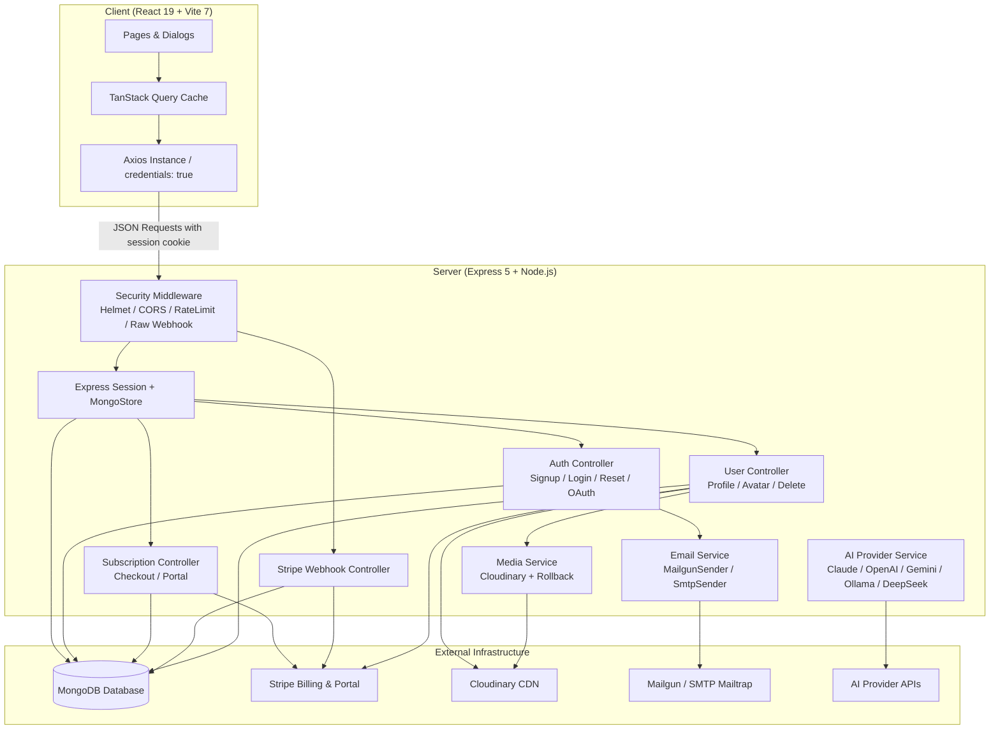

# SaaS-Starter-MERN-Kit-w/-Payment-GAuth-Emails


A modular, production-ready full-stack SaaS foundation built with **React 19, TypeScript, Express 5, MongoDB (Mongoose 8), and Stripe**. 

This starter kit provides core infrastructure required by modern subscription software: server-side session authentication with Passport, email OTP verification, cryptographic password recovery, Stripe subscription billing with automated webhook reconciliation, atomic Cloudinary media uploads, dual Mailgun/SMTP transactional email, and an extensible multi-provider AI abstraction.

---

## Table of Contents

- [Overview](#overview)
- [Feature Matrix](#feature-matrix)
- [Technology Stack](#technology-stack)
- [Architecture Overview](#architecture-overview)
- [Authentication & Account Lifecycle](#authentication--account-lifecycle)
- [Billing & Stripe Subscription Flow](#billing--stripe-subscription-flow)
- [Transactional Email Architecture](#transactional-email-architecture)
- [Media & Cloudinary Pipeline](#media--cloudinary-pipeline)
- [Reusable AI Provider Abstraction](#reusable-ai-provider-abstraction)
- [Environment Variables](#environment-variables)
- [Setup & Local Development](#setup--local-development)
- [Project Directory Structure](#project-directory-structure)
- [Available Scripts](#available-scripts)
- [Security Architecture & OWASP ASVS Alignment](#security-architecture--owasp-asvs-alignment)
- [Key Architectural Decisions](#key-architectural-decisions)
- [What I Learned Building This](#what-i-learned-building-this)
- [Project Status & Known Limitations](#project-status--known-limitations)
- [Troubleshooting Guide](#troubleshooting-guide)
- [Production Deployment](#production-deployment)
- [License & Attribution](#license--attribution)

---

## Overview

Bootstrapping a modern Software-as-a-Service product repeatedly requires solving the same non-trivial infrastructure challenges: reliable subscription state synchronization via webhooks, secure session-based authentication across client and API domains, account recovery without credential enumeration, third-party asset rollback on database failures, and extensible provider integrations.

**SaaS-Starter-MERN-Kit-w/-Payment-GAuth-Emails** is an unopinionated, clean foundation designed to eliminate that initial setup overhead while avoiding brittle abstractions. The codebase is organized as an npm monorepo with strict client/server workspace separation, full TypeScript coverage across all layers, and hardened security defaults based on OWASP ASVS guidelines.

---

## Feature Matrix

| Domain | What It Provides | Implementation Status |
| :--- | :--- | :--- |
| **Authentication** | Email/password login with bcrypt, session persistence in MongoDB (`connect-mongo`), Passport.js local strategy, Google OAuth 2.0 (OIDC) callback flow. | **Active Feature** |
| **Email Verification** | Cryptographically secure 4-digit OTP generated via `crypto.randomInt`, delivered by email, tracked in MongoDB with expiration and attempt limiting. | **Active Feature** |
| **Password Recovery** | Single-use SHA-256 hashed reset token architecture with 15-minute TTL; enumeration-safe responses for local and OAuth accounts. | **Active Feature** |
| **Account Management** | Name updates, avatar updates, and full account deletion with automated Stripe subscription termination, asset cleanup, and session destruction. | **Active Feature** |
| **Billing & Plans** | Multi-tier subscription checkout via Stripe Checkout Sessions (monthly/annual pricing), self-serve billing and cancellation via Stripe Customer Portal. | **Active Feature** |
| **Stripe Webhooks** | Signature-verified webhook handler on raw request stream (`/webhook`) reconciling `checkout.session.completed`, `async_payment_succeeded`, `subscription.updated`, and `subscription.deleted`. | **Active Feature** |
| **Media Storage** | Cloudinary integration with Multer limits (5MB, image MIME filter), temp-file cleanup, and atomic rollback (deleting uploaded asset if DB write fails). | **Active Feature** |
| **Transactional Email** | Pluggable dual-provider system: Mailgun for production and SMTP/Nodemailer for local sandbox testing, switched via `EMAIL_PROVIDER`. | **Active Feature** |
| **Client State & Cache** | TanStack Query (React Query v5) for server state management, query deduplication, prefetching, and explicit cache invalidation. | **Active Feature** |
| **UI Components** | Modern dark-mode interface built with Tailwind CSS v4, Radix UI primitives, Lucide icons, and React Toastify notifications. | **Active Feature** |
| **AI Infrastructure** | Multi-provider AI abstraction supporting Anthropic Claude, OpenAI, Google Gemini, Ollama, and DeepSeek with probing, streaming, and token metrics. | **Included Foundation** *(reusable service)* |
| **Analytics / Export** | Retained Chart.js and client-side PDF export tooling (`react-to-pdf`, `html2canvas-pro`, `jspdf`) for SaaS dashboard reports. | **Included Foundation** *(ready for views)* |

---

## Technology Stack

| Layer | Technology | Version / Spec | Purpose |
| :--- | :--- | :--- | :--- |
| **Frontend Framework** | [React](https://react.dev/) | 19.1 | Declarative component UI library |
| **Client Tooling** | [Vite](https://vitejs.dev/) | 7.1 | Fast HMR dev server and optimized Rollup production bundler |
| **Styling** | [Tailwind CSS](https://tailwindcss.com/) | 4.1 | Utility-first styling with OKLCH theme tokens |
| **UI Primitives** | [Radix UI](https://www.radix-ui.com/) | 1.4 | Accessible, unstyled UI primitives (Dialog, Popover, Menu) |
| **Server State** | [TanStack Query](https://tanstack.com/query/latest) | 5.85 | Client-side cache, query deduplication, background invalidation |
| **Backend Runtime** | [Node.js](https://nodejs.org/) | >= 18.0 | Server-side JavaScript runtime |
| **HTTP Framework** | [Express](https://expressjs.com/) | 5.1 | Lightweight REST API routing and middleware pipeline |
| **Database** | [MongoDB](https://www.mongodb.com/) via [Mongoose](https://mongoosejs.com/) | 8.17 | Document database and object data modeling |
| **Session Store** | [connect-mongo](https://github.com/jdesboeufs/connect-mongo) | 5.1 | MongoDB-backed Express session storage |
| **Authentication** | [Passport.js](https://www.passportjs.org/) | 0.7 | Local credential and Google OIDC authentication |
| **Payments** | [Stripe Node SDK](https://github.com/stripe/stripe-node) | 22.6 (API `2026-08-26.dahlia`) | Checkout sessions, billing portal, and webhooks |
| **Media Management** | [Cloudinary](https://cloudinary.com/) + [Multer](https://github.com/expressjs/multer) | 2.7 / 2.0 | Multipart file validation and cloud asset storage |
| **Transactional Email** | [Mailgun.js](https://github.com/mailgun/mailgun.js) + [Nodemailer](https://nodemailer.com/) | 11.1 / 7.0 | Dual-provider transactional email delivery |
| **Monitoring** | [Sentry Node SDK](https://sentry.io/) | 10.23 | Distributed tracing and production error logging |
| **Language** | [TypeScript](https://www.typescriptlang.org/) | 5.9 / tsgo | Static type safety across client and server |

---

## Architecture Overview



### Request Lifecycle
1. **Inbound HTTP Request:** Evaluated by `helmet`, CORS policy with origin validation, and `express-rate-limit`.
2. **Raw Webhook Stream:** Requests to `/webhook` preserve the unparsed body via `express.raw({ type: 'application/json' })` for cryptographic Stripe signature verification before `express.json()` runs.
3. **Session Hydration:** `express-session` reads the `connect.sid` cookie, retrieves session state from MongoDB via `MongoStore`, and Passport deserializes `req.user`.
4. **Controller & Validation Layer:** Input validators verify email formats, password strength, and request parameters.
5. **Data & External Execution:** Business operations update MongoDB collections, trigger Stripe APIs, dispatch transactional emails, or upload assets to Cloudinary.
6. **Client Rehydration:** Client receives typed JSON; TanStack Query updates local cache and triggers reactive UI re-renders without full page reloads.

---

## Authentication & Account Lifecycle

### 1. Sign-Up & Email OTP Verification
- **Step 1:** User enters name, email, and password. Client verifies password rules and requests OTP via `POST /api/auth/sendValidationCodeEmail`.
- **Step 2:** Server validates payload using `SignUpUserValidator`, ensures email is available, generates a 4-digit code using `crypto.randomInt(1000, 10000)`, stores it in `EmailValidation` (with attempt counter and TTL), and delivers it via the configured email provider.
- **Step 3:** Client submits OTP to `PUT /api/auth/checkSignUpEmailCode`. If code matches, record is consumed (preventing replay).
- **Step 4:** Account is finalized via `POST /api/auth/signup`. Password is automatically hashed with `bcryptjs` (salt rounds: 10) in a Mongoose `pre('save')` hook, and the user is logged into the session.

### 2. Login, Sessions & Google OAuth
- **Local Login:** `POST /api/auth/login` verifies credentials via Passport's local strategy. On success, writes `lastLogin` timestamp to the database and returns user profile data (`_id`, `name`, `email`, `profilePhoto`).
- **Session Cookie:** Stored in MongoDB collection `sessions` via `connect-mongo`. Configured with `httpOnly: true`, `secure: true` in production, `sameSite: 'none'` (for decoupled domains) or `'lax'`, and a 14-day TTL.
- **Google OAuth 2.0:** Initiated at `GET /api/auth/google` (requesting `profile` and `email`). Callback at `GET /api/auth/google/callback` creates or links the local user account (`source: 'google'`), initializes the session, and redirects to the frontend.

### 3. Enumeration-Safe Password Recovery
- **Request Code:** `POST /api/auth/sendForgotPasswordEmail` accepts an email. If the account does not exist or was registered via Google OAuth, the server returns the **identical HTTP 200 message**: `"If an account with that email exists, a recovery email has been sent"`.
- **Token Exchange:** Once the OTP is validated via `PUT /api/auth/checkValidationCodeEmail`, a 256-bit cryptographically random token is generated.
- **Token Hashing:** The server stores only the **SHA-256 hash** of the token in `PasswordResetToken` (15-minute TTL) and returns the raw token to the client once.
- **Password Reset:** `PUT /api/auth/changePassword` verifies the submitted raw token against the database hash, updates the password, and deletes the token document (single-use).

### 4. Account Deletion (`DELETE /api/user/deleteUser`)
Account deletion executes an atomic cleanup workflow:
1. Deletes user document from MongoDB (`User.findByIdAndDelete`).
2. Cancels any active Stripe subscriptions via `stripe.subscriptions.cancel` to guarantee no recurring charges continue post-deletion.
3. Removes `Subscription` records from MongoDB.
4. Deletes profile avatar asset from Cloudinary using `profilePhotoPublicId`.
5. Destroys the Express session (`req.session.destroy()`) and unsets authentication cookies.

---

## Billing & Stripe Subscription Flow

### 1. Checkout Session Creation
- User selects a plan on the Pricing page (Standard or Pro, billed monthly or annually).
- Client calls `POST /api/subscriptions/create-checkout-session` with `priceId` and `isAnnual`.
- Server validates that `priceId` matches an authorized price ID defined in `server/src/config/stripeConfig.ts`.
- Server ensures the user has a `stripeCustomerId` (creating one at Stripe if absent), generates a Stripe Checkout Session with `mode: 'subscription'`, and attaches `userId` in session metadata.
- Frontend redirects directly to Stripe's hosted checkout page (`sessionUrl`).

### 2. Webhook Event Processing (`POST /webhook`)
The webhook handler verifies raw request bytes against `STRIPE_WEBHOOK_SECRET` and handles 4 core event types:

```
[Stripe Checkout] ──> checkout.session.completed / async_payment_succeeded
                           │
                           ▼
                 updateSubscriptionInDB()
                 ├── Queries Stripe subscription object
                 ├── Resolves plan name ('standard' | 'pro') from price ID
                 ├── Extracts currentPeriodStart & currentPeriodEnd
                 ├── Cancels any previously active subscriptions for user
                 └── Upserts record into MongoDB 'Subscription' collection

[Stripe Billing]  ──> customer.subscription.updated
                           │
                           ▼
                 Updates status, priceId, cancelAtPeriodEnd in MongoDB

[Cancellation]   ──> customer.subscription.deleted
                           │
                           ▼
                 Matches record by immutable stripeSubscriptionId
                 Sets status: 'canceled', plan: 'free', stripeSubscriptionId: null
```

### 3. Customer Billing Portal
- Users manage invoices, update payment cards, or cancel plans without custom forms.
- Calling `POST /api/subscriptions/create-portal-session` creates a Stripe Billing Portal session linked to `user.stripeCustomerId` with `return_url` pointing to the user's profile settings.

---

## Transactional Email Architecture

Email delivery uses a clean provider abstraction defined in [`server/src/services/email/`](server/src/services/email/):

```
                       ┌─────────────────────────┐
                       │   IEmailSender Interface │
                       │    send(options): void   │
                       └────────────┬────────────┘
                                    │
              ┌─────────────────────┴─────────────────────┐
              ▼                                           ▼
   ┌───────────────────────┐                   ┌─────────────────────┐
   │    MailgunSender      │                   │     SmtpSender      │
   │ (Production Delivery) │                   │  (Dev / Mailtrap)   │
   └───────────────────────┘                   └─────────────────────┘
```

The active provider is chosen at runtime based on `EMAIL_PROVIDER`:
- `EMAIL_PROVIDER=mailgun` (default): Uses `mailgun.js` with `MAILGUN_API_KEY` and `MAILGUN_DOMAIN`.
- `EMAIL_PROVIDER=smtp`: Uses `nodemailer` with `SMTP_HOST`, `SMTP_PORT`, `SMTP_USER`, and `SMTP_PASS` (ideal for Mailtrap, Ethereal, or local SMTP).

Templates are separated into [`ValidationCodeEmailTemplate.ts`](server/src/services/email/ValidationCodeEmailTemplate.ts), providing HTML and plain-text fallbacks.

---

## Media & Cloudinary Pipeline

Avatar uploads are handled in [`server/src/controllers/userController.ts`](server/src/controllers/userController.ts) using a resilient two-phase commit pattern:

1. **Upload Phase:** Multer intercepts the multipart upload, enforcing a strict 5MB ceiling and verifying image MIME types (`image/jpeg`, `image/png`, `image/webp`, `image/gif`), staging the file in `temp-uploads/`.
2. **Cloudinary Ingestion:** Asset is streamed to Cloudinary using `cloudinary.uploader.upload`. The temporary disk file is unconditionally unlinked in a `finally` block.
3. **Atomic Rollback:**
   - If user record lookup or database update fails, the newly uploaded Cloudinary asset is **immediately deleted** via `deleteImage(uploadResult.publicId)` to prevent orphaned cloud storage.
   - If database update succeeds, the **previous** profile asset (`user.profilePhotoPublicId`) is deleted from Cloudinary.

---

## Reusable AI Provider Abstraction

The starter includes an enterprise-grade multi-provider AI abstraction located in [`server/src/services/aiProviderService.ts`](server/src/services/aiProviderService.ts). It provides a unified API across 5 leading LLM providers:

```
                  ┌───────────────────────────────┐
                  │          IAIProvider          │
                  │   chat(req): Promise<ChatRes> │
                  │   isAvailable(): Promise<bool>│
                  └───────────────┬───────────────┘
                                  │
    ┌──────────────┬──────────────┼──────────────┬──────────────┐
    ▼              ▼              ▼              ▼              ▼
┌────────┐   ┌──────────┐   ┌──────────┐   ┌──────────┐   ┌──────────┐
│ Claude │   │  OpenAI  │   │  Gemini  │   │  Ollama  │   │ DeepSeek │
└────────┘   └──────────┘   └──────────┘   └──────────┘   └──────────┘
```

### Supported Providers & Default Models
- **Claude:** `claude-sonnet-4-5-20250929` via Anthropic Messages API (`https://api.anthropic.com/v1/messages`).
- **OpenAI:** `gpt-4-turbo-preview` via OpenAI Chat Completions (`https://api.openai.com/v1/chat/completions`).
- **Gemini:** `gemini-pro` via Google Generative Language API (`https://generativelanguage.googleapis.com/v1`).
- **Ollama:** `llama3.1` via local Ollama daemon (`http://localhost:11434/api/chat`).
- **DeepSeek:** `deepseek-chat` via DeepSeek OpenAI-compatible endpoint (`https://api.deepseek.com/v1/chat/completions`).

### Capabilities
- **Standardized Types:** Unified `ChatMessage`, `ChatRequest`, `ChatResponse` (with normalized `inputTokens`, `outputTokens`, `totalTokens`).
- **Health Probing:** `isAvailable()` performs a low-overhead probe against provider endpoints before routing requests.
- **Factory & Switching:** `AIProviderFactory.create(type, config)` and `AIChatService.switchProvider(type, config)` enable dynamic runtime model switching.
- *Note:* This service is included as a reusable backend infrastructure component ready for developers to expose in custom routes.

---

## Environment Variables

### Server Configuration (`server/.env.dev` / `server/.env.production`)

| Variable | Required | Default / Example | Purpose |
| :--- | :---: | :--- | :--- |
| `NODE_ENV` | Yes | `development` / `production` | Runtime mode toggle |
| `APP_PORT` | No | `3000` | Express HTTP server listen port |
| `DB_STRING` | Yes | `mongodb://localhost:27017/saas-starter` | MongoDB connection URI |
| `FRONT_END_URL` | Yes | `localhost:5173` | Allowed frontend origin for CORS and OAuth redirects |
| `CORS_EXTRA_ORIGINS` | No | `https://admin.example.com` | Comma-separated secondary CORS origins |
| `EXPRESS_SESSION_SECRET` | Yes | `random-32-char-string` | Secret used to sign session cookies |
| `WEBSITE_DOMAIN` | Yes | `example.com` | Domain used for outgoing sender addresses |
| `EMAIL_PROVIDER` | No | `smtp` (dev) / `mailgun` (prod) | Email gateway driver |
| `MAILGUN_API_KEY` | If mailgun | `key-...` | Mailgun API credentials |
| `MAILGUN_DOMAIN` | If mailgun | `mg.example.com` | Mailgun sending domain |
| `SMTP_HOST` | If smtp | `smtp.mailtrap.io` | SMTP server address |
| `SMTP_PORT` | If smtp | `2525` | SMTP server port |
| `SMTP_USER` | If smtp | `username` | SMTP authentication user |
| `SMTP_PASS` | If smtp | `password` | SMTP authentication password |
| `CLOUDINARY_CLOUD_NAME` | Yes | `your-cloud-name` | Cloudinary account cloud identifier |
| `CLOUDINARY_API_KEY` | Yes | `1234567890` | Cloudinary API Key |
| `CLOUDINARY_API_SECRET` | Yes | `secret-...` | Cloudinary API Secret |
| `STRIPE_SECRET_KEY` | Yes | `sk_test_...` | Stripe secret key for backend API operations |
| `STRIPE_WEBHOOK_SECRET` | Yes | `whsec_...` | Signing secret for verifying webhook payloads |
| `STRIPE_STANDARD_MONTHLY_PRICE_ID` | Yes | `price_...` | Stripe Price ID for Standard Monthly plan |
| `STRIPE_STANDARD_ANNUAL_PRICE_ID` | Yes | `price_...` | Stripe Price ID for Standard Annual plan |
| `STRIPE_PRO_MONTHLY_PRICE_ID` | Yes | `price_...` | Stripe Price ID for Pro Monthly plan |
| `STRIPE_PRO_ANNUAL_PRICE_ID` | Yes | `price_...` | Stripe Price ID for Pro Annual plan |
| `GOOGLE_CLIENT_ID` | If Google auth | `...apps.googleusercontent.com` | Google OAuth 2.0 Client ID |
| `GOOGLE_CLIENT_SECRET` | If Google auth | `GOCSPX-...` | Google OAuth 2.0 Client Secret |
| `GOOGLE_CALLBACK_URL` | If Google auth | `http://localhost:3000/api/auth/google/callback` | OAuth callback redirect URL |
| `GOOGLE_RECAPTCHA_SECRET_KEY` | Optional | `6Le...` | reCAPTCHA v2 secret key (bypassed in dev if unset) |
| `SENTRY_DSN` | No | `https://...@sentry.io/...` | Sentry DSN for error telemetry |

### Client Configuration (`client/.env.development` / `client/.env.production`)

| Variable | Required | Default / Example | Purpose |
| :--- | :---: | :--- | :--- |
| `VITE_API_URL` | Yes | `http://localhost:3000` | Backend API base URL for Axios |
| `VITE_STRIPE_PUBLISHABLE_KEY` | Yes | `pk_test_...` | Stripe publishable key for client elements |
| `VITE_STRIPE_STANDARD_MONTHLY_PRICE_ID` | Yes | `price_...` | Must match server Price ID |
| `VITE_STRIPE_STANDARD_ANNUAL_PRICE_ID` | Yes | `price_...` | Must match server Price ID |
| `VITE_STRIPE_PRO_MONTHLY_PRICE_ID` | Yes | `price_...` | Must match server Price ID |
| `VITE_STRIPE_PRO_ANNUAL_PRICE_ID` | Yes | `price_...` | Must match server Price ID |
| `VITE_RECAPTCHA_SITE_KEY` | Optional | `6Le...` | Google reCAPTCHA v2 site key |

---

## Setup & Local Development

### Prerequisites
- **Node.js:** `>= 18.0.0`
- **npm:** `>= 9.0.0`
- **MongoDB:** Local instance running at `mongodb://localhost:27017` or a MongoDB Atlas cluster URI.

### Step 1: Clone and Install Dependencies
```bash
git clone https://github.com/your-username/SaaS-Starter-MERN-Kit-w/-Payment-GAuth-Emails.git
cd SaaS-Starter-MERN-Kit-w/-Payment-GAuth-Emails

# Install dependencies across root and all workspaces
npm run install:all
```

### Step 2: Configure Environment Files
```bash
# Server configuration
cp server/.env.example server/.env.dev

# Client configuration
cp client/.env.example client/.env.development
```
Open `server/.env.dev` and configure `DB_STRING`, `EXPRESS_SESSION_SECRET`, and external API keys (or leave `EMAIL_PROVIDER=smtp` pointing to a free Mailtrap account).

### Step 3: Run Development Servers
You can run both client and server concurrently from the repository root:
```bash
npm run dev
```
- **Backend API:** `http://localhost:3000`
- **Frontend SPA:** `http://localhost:5173`

Alternatively, run each workspace in separate terminal windows:
```bash
# Terminal 1: Backend
npm run server

# Terminal 2: Frontend
npm run client
```

### Step 4: Local Stripe Webhook Forwarding
To test Stripe checkout and cancellation events locally:
```bash
stripe listen --forward-to localhost:3000/webhook
```
Copy the printed webhook signing secret (`whsec_...`) into `server/.env.dev` under `STRIPE_WEBHOOK_SECRET`.

---

## Project Directory Structure

```
SaaS-Starter-MERN-Kit-w/-Payment-GAuth-Emails/
├── caddy/                           # Production reverse proxy configuration
│   ├── Caddyfile                    # Production routing and SSL
│   └── Dockerfile
├── client/                          # React 19 + Vite Frontend SPA
│   ├── src/
│   │   ├── api/                     # Typed Axios request functions
│   │   ├── classes/                 # Client-side input validators
│   │   ├── components/              # Dialogs, Navbar, UI primitives
│   │   │   └── ui/                  # Radix UI wrappers (Button, Dialog, etc.)
│   │   ├── hooks/                   # Custom hooks & TanStack Query mutations
│   │   ├── layouts/                 # MainLayout shell
│   │   ├── pages/                   # Route views (Homepage, Pricing, Profile)
│   │   ├── routes/                  # React Router v7 router and ProtectedRoute
│   │   ├── services/                # Axios instance & subscription client
│   │   ├── types/                   # Shared client TypeScript interfaces
│   │   └── utils/                   # Theme provider & helper utilities
│   ├── package.json
│   └── vite.config.ts
├── server/                          # Express 5 + Node.js Backend API
│   ├── src/
│   │   ├── config/                  # Passport, Stripe, Sentry, instrumentation
│   │   ├── controllers/             # Request handlers (auth, stripe, user, sub)
│   │   ├── core/                    # Server-side input validation classes
│   │   ├── database/                # MongoDB connection lifecycle
│   │   ├── middleware/              # Auth guards, Multer, reCAPTCHA
│   │   ├── models/                  # Mongoose models (User, Subscription, etc.)
│   │   ├── routes/                  # Express route declarations
│   │   ├── services/                # AI, Cloudinary media, and email providers
│   │   ├── types/                   # Server TypeScript interfaces
│   │   └── server.ts                # Server entrypoint and middleware assembly
│   ├── package.json
│   └── tsconfig.json
├── compose.dev.yaml                 # Docker compose for local multi-container dev
├── compose.yaml                     # Docker compose for production deployments
├── package.json                     # Root monorepo workspace configuration
├── LICENSE                          # Apache License 2.0
└── NOTICE                           # Attribution notice
```

---

## Available Scripts

### Root Workspace Commands
- `npm run dev` — Starts backend and frontend development servers concurrently.
- `npm run build` — Compiles production bundles across both workspaces (`client` and `server`).
- `npm run lint` — Executes ESLint across all TypeScript and React files.
- `npm test` — Runs automated test suites across all workspaces.
- `npm run clean` — Cleans build artifacts, `node_modules`, and cache directories.

### Workspaces-Specific Commands
- `npm run client` — Runs Vite development server for `client`.
- `npm run server` — Runs nodemon development server for `server`.
- `npm run build:client` — Runs TypeScript compile (`tsgo`) and Vite production build.
- `npm run build:server` — Runs TypeScript compile (`tsgo`) for the server.

---

## Security Architecture & OWASP ASVS Alignment

| Security Mechanism | Implementation in Code | OWASP ASVS Reference |
| :--- | :--- | :--- |
| **CSPRNG OTP Generation** | [`SendValidationCode.ts`](server/src/services/email/SendValidationCode.ts): Uses `crypto.randomInt` rather than predictable `Math.random()`. | V2.2.2 (Cryptographic Security) |
| **Cryptographic Reset Tokens** | [`PasswordResetTokenModel.ts`](server/src/models/PasswordResetTokenModel.ts): Raw 256-bit reset tokens are hashed with SHA-256 before storage; single-use with 15-minute TTL. | V2.5.7 (Credential Recovery) |
| **User Enumeration Defense** | [`authController.ts`](server/src/controllers/authController.ts): Returns uniform HTTP 200 response on recovery requests regardless of account existence or OAuth provider. | V2.5.6 (Account Harvesting) |
| **Session Security** | [`server.ts`](server/src/server.ts): Cookies are configured `httpOnly: true`, `secure: true` in production, with server-managed invalidation. | V3.3.1 (Session Management) |
| **File Upload Defense** | [`multer.ts`](server/src/middleware/multer.ts): Strictly limits uploads to 5MB, validates image MIME types, and guarantees temp file deletion. | V12.1.1 & V12.4.1 (Upload Security) |
| **Rate Limiting** | [`server.ts`](server/src/server.ts): Uses `express-rate-limit` with IP grouping across standard 10-minute windows. | V13.1.5 (Brute Force Defense) |
| **Webhook Authenticity** | [`stripeWebhookController.ts`](server/src/controllers/stripeWebhookController.ts): Validates Stripe signature against unparsed raw body bytes. | V13.2.3 (API Integrity) |
| **HTTP Security Headers** | [`server.ts`](server/src/server.ts): Implements `helmet` to set X-Content-Type-Options, Strict-Transport-Security, and frameguards. | V14.4.1 (Browser Security) |

---

## Key Architectural Decisions

1. **Session-Based Authentication over Stateless JWTs:**  
   Stateless JWTs stored in browser `localStorage` are vulnerable to XSS token theft and cannot be revoked without maintaining a distributed token blacklist. SaaS-Starter-MERN-Kit-w/-Payment-GAuth-Emails uses server-side sessions stored in MongoDB via `connect-mongo`. This allows instantaneous session revocation on password changes, account deletion, or administrative termination.

2. **Dedicated `Subscription` Collection vs Embedding in `User`:**  
   Subscription states frequently change independently of user profiles (renewals, billing retries, invoices, tier changes). Decoupling subscriptions into their own collection allows clean indexing by `stripeSubscriptionId`, preserves audit histories, and allows future expansion into multi-seat or team-based subscriptions without modifying core user schemas.

3. **Atomic Third-Party Asset Rollback:**  
   Handling external API state alongside local databases requires defensive failure compensation. In the avatar update flow, Cloudinary upload occurs first; if the database update fails, the newly uploaded asset is deleted immediately to prevent orphaned storage bloat.

4. **TanStack Query with `staleTime: Infinity` on User State:**  
   The authenticated user object rarely mutates without an explicit user action. Keeping `staleTime: Infinity` avoids unnecessary API requests on every window focus while maintaining cache correctness through deliberate mutation hooks (`setQueryData` on login/logout/delete).

---

## What I Learned Building This

Building a reusable SaaS foundation highlights the fundamental difference between building a single product and engineering an extensible system. In a specific application, developers take shortcuts because the domain constraints are known. In a starter kit, assumptions must hold across many unforeseen business requirements.

The most challenging technical aspect of this architecture was **webhook and distributed state resilience**. Stripe webhooks arrive asynchronously and out of order. Relying on transient request metadata like `metadata.userId` during cancellation events causes silent data corruption when subscriptions are modified directly in the Stripe Dashboard. Grounding synchronization strictly on immutable provider identifiers (`stripeSubscriptionId`) and implementing idempotent upserts proved essential.

Another key takeaway was **managing third-party service boundaries without over-abstraction**. It is tempting to write elaborate multi-layered interfaces for every external tool. The pragmatic approach adopted here was abstracting volatile infrastructure where it matters (dual email delivery and multi-provider AI) while leaving straightforward integrations like Stripe and Cloudinary direct, explicit, and type-sound.

---

## Project Status & Known Limitations

### Fully Implemented
- Local authentication, Google OAuth 2.0, OTP email activation, and secure password reset.
- Stripe subscription lifecycle (Checkout, Customer Portal, Webhook synchronization).
- Profile management and Cloudinary avatar pipeline with failure compensation.
- Express 5 server configuration with Helmet, CORS origin whitelisting, rate limiting, and terminal JSON error formatting.
- React 19 SPA with protected route guards, responsive navbar, dark mode, and pricing tables.

### Included Infrastructure (Ready for Domain Implementation)
- **Multi-Provider AI Abstraction:** `aiProviderService.ts` is fully implemented and tested, supporting Claude, OpenAI, Gemini, Ollama, and DeepSeek. Ready to be mapped to custom business endpoints.
- **Reporting / Export Tooling:** Chart.js configurations and PDF export infrastructure (`react-to-pdf`, `html2canvas-pro`, `jspdf`) are included for building SaaS analytics dashboards.

### Developer Configuration Required
- Developers must provide their own Stripe Price IDs and API keys.
- Developers must provide Cloudinary credentials and email provider credentials (or Mailtrap for local SMTP).
- Production deployment requires configuring `FRONT_END_URL` and reverse proxy SSL certificates.

### Known Limitations
- **Monorepo Shared Code:** Validation classes (`SignUpUserValidator`, `LoginUserValidator`, `ChangePasswordValidator`) and TypeScript interfaces are currently mirrored across `client` and `server`. A future version will extract them into an npm workspace package (`@shared/`).
- **Server Integration Tests:** The client includes Jest tests for validators (`LoginUserValidator.spec.ts`), but automated end-to-end integration tests for Express API routes are not yet included.

---

## Troubleshooting Guide

### 1. CORS Errors During Login / Registration
- **Cause:** `FRONT_END_URL` in `server/.env.dev` does not match the exact origin of your frontend, or `credentials: true` is missing.
- **Solution:** Verify `FRONT_END_URL=localhost:5173` in `server/.env.dev`. If accessing via custom IP or domain, add it to `CORS_EXTRA_ORIGINS`.

### 2. Stripe Webhook Signature Verification Fails (`400 Webhook Error`)
- **Cause:** Webhook request body was parsed before signature checking, or `STRIPE_WEBHOOK_SECRET` is incorrect.
- **Solution:** In `server.ts`, `/webhook` is mounted with `express.raw({ type: 'application/json' })` before `express.json()`. Ensure your `STRIPE_WEBHOOK_SECRET` matches the secret generated by the Stripe CLI or Dashboard.

### 3. Google OAuth Redirects to Wrong URL
- **Cause:** `GOOGLE_CALLBACK_URL` in `server/.env.dev` or Google Cloud Console does not match `http://localhost:3000/api/auth/google/callback`.
- **Solution:** Ensure the authorized redirect URI in Google Cloud Console matches the environment variable exactly.

### 4. Avatar Upload Fails with 400
- **Cause:** File exceeds 5MB or file type is not an allowed image format.
- **Solution:** Multer rejects files exceeding 5,242,880 bytes or files with MIME types other than JPEG, PNG, WEBP, or GIF.

---

## Production Deployment

### Building Production Bundles
```bash
# Build both workspaces
npm run build

# Start production Express server
npm run start
```

### Multi-Container Docker Deployment
The repository includes a production Docker setup utilizing Caddy as an automatic HTTPS reverse proxy:

```bash
# Set your domain name in environment
export DOMAIN_NAME=yourdomain.com

# Launch production stack (Mongo, Server, Client, Caddy reverse proxy)
docker compose up --build -d
```
- **Caddy:** Terminates SSL on ports 80/443 and routes traffic to `client` and `server`.
- **MongoDB:** Persists data inside Docker volume `mongo_data`.
- **Uptime Kuma:** Optional monitoring service accessible at port 3001.

---

## License & Attribution

This project is licensed under the **Apache License 2.0**. See the [LICENSE](LICENSE) file for complete details.

### Attribution
See the [NOTICE](NOTICE) file for original project attribution:
```text
SaaS-Starter-MERN-Kit-w/-Payment-GAuth-Emails
Copyright 2026 Ahmad

Original project:
https://github.com/viitormasc/SaaS-Subscription-Auth-Starter-Kit

This project was created by Ahmad.
```
